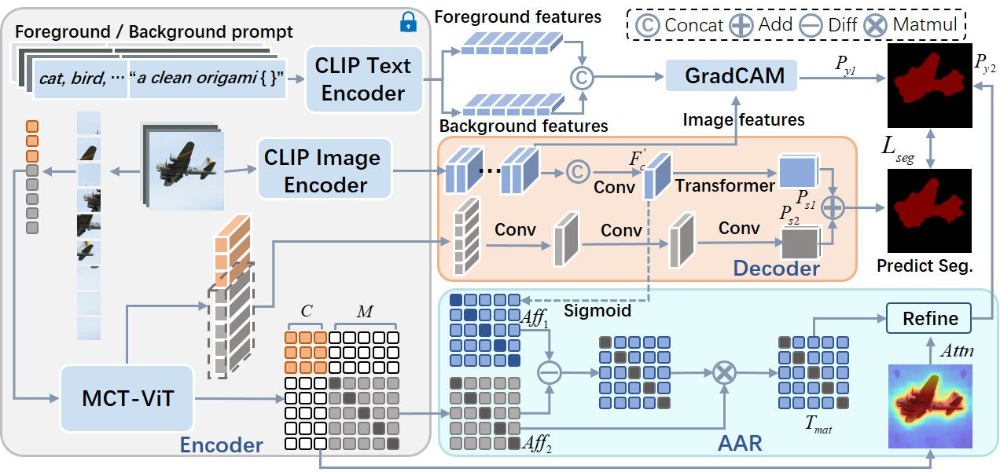

## CLIP-ViT based Multi-Modal Fusion with Affinity Alignment for Weakly Supervised Semantic Segmentation

<div align="center">

<br>
  
</div>

<!-- ## Abastract -->
we propose a new model named as CLIP-ViT Fusion (CVF) to address the challenge by integrating the cross-modal prior knowledge of CLIP with multi-level class-specific discriminative representations of ViTs.

## Data Preparations
<details>
<summary>
VOC dataset
</summary>

#### 1. Download

``` bash
wget http://host.robots.ox.ac.uk/pascal/VOC/voc2012/VOCtrainval_11-May-2012.tar
tar –xvf VOCtrainval_11-May-2012.tar
```
#### 2. Download the augmented annotations
The augmented annotations are from [SBD dataset](http://home.bharathh.info/pubs/codes/SBD/download.html). Here is a download link of the augmented annotations at
[DropBox](https://www.dropbox.com/s/oeu149j8qtbs1x0/SegmentationClassAug.zip?dl=0). After downloading ` SegmentationClassAug.zip `, you should unzip it and move it to `VOCdevkit/VOC2012`. The directory sctructure should thus be 

``` bash
VOCdevkit/
└── VOC2012
    ├── Annotations
    ├── ImageSets
    ├── JPEGImages
    ├── SegmentationClass
    ├── SegmentationClassAug
    └── SegmentationObject
```
</details>

<details>

<summary>
COCO dataset
</summary>

#### 1. Download
``` bash
wget http://images.cocodataset.org/zips/train2014.zip
wget http://images.cocodataset.org/zips/val2014.zip
```
#### 2. Generating VOC style segmentation labels for COCO
To generate VOC style segmentation labels for COCO dataset, you could use the scripts provided at this [repo](https://github.com/alicranck/coco2voc). Or, just download the generated masks from [Google Drive](https://drive.google.com/file/d/147kbmwiXUnd2dW9_j8L5L0qwFYHUcP9I/view?usp=share_link).

I recommend to organize the images and labels in `coco2014` and `SegmentationClass`, respectively.

``` bash
MSCOCO/
├── coco2014
│    ├── train2014
│    └── val2014
└── mask
     ├── train2014
     └── val2014
```


</details>

## Create environment
``` bash 
conda create --name py38 python=3.8
conda activate py38
pip install -r requirments.txt

```

### Download Pre-trained CLIP-VIT/16 Weights

Download the pre-trained CLIP-VIT/16 weights from the official [link](https://openaipublic.azureedge.net/clip/models/5806e77cd80f8b59890b7e101eabd078d9fb84e6937f9e85e4ecb61988df416f/ViT-B-16.pt).

### Train & Inference
To start training and inference, first modify the inference model path `--model_path` in `test_msc_flip_voc` or `test_msc_flip_voc` Then, run the following code:
```bash
## for VOC
bash run_voc.sh
## for COCO
bash run_coco.sh
```
The code will be perfected soon...
